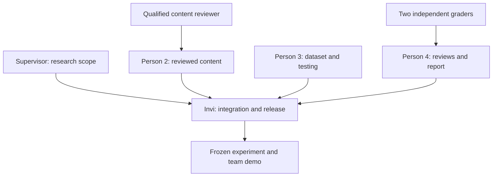

# Four-person work distribution and chain of command

Replace Person 2–4 with teammate names at kickoff. Invi is the integration lead, not the person who silently finishes every unfinished task.

## Ownership chart

| Owner | Work and files | Beginner-friendly first action | Done means | Reviewer |
|---|---|---|---|---|
| Invi — technical / experiment lead | `app.py`, evaluator/adapters, study CLI, tests, run configuration | Run the app and explain one loop to the team | Verified application; frozen configuration; recorded real experiment; reproducible commands | Supervisor for design; teammate repeats commands |
| Person 2 — content / references | `data/concepts.json`, content review register, literature matrix | Read one concept and its linked source; list unclear terms | Each selected concept has checked facts, specific scoring anchors, known misconceptions and expert sign-off | Knowledgeable faculty/senior; Invi checks JSON |
| Person 3 — dataset / testing | Private answer dataset, provenance register, bug log | Complete a practice session; report expected vs actual behavior with steps | Clean anonymized records with truthful sources/consent; varied answers; reproducible bug reports | Invi validates format; Person 4 checks records |
| Person 4 — study coordination / documentation | Review sheets, review tracking, protocol, report, demo | Explain the scoring instructions back to the team | Two independent completed review sets; version records; report and presentation draft grounded in outputs | Invi checks results; supervisor checks conclusions |

## What each person should learn

- Invi: prompt controls, leakage, paired evaluation, confidence intervals, provider failures.
- Person 2: rubric versus model answer, reference quality, acceptable alternative explanations.
- Person 3: provenance, anonymization, consent, normal/boundary/adversarial test cases.
- Person 4: independent grading, blinding, disagreement, correlation versus agreement, evidence versus claims.

No teammate has to pretend to be an AI expert. They must understand and defend the work they actually did. Coordination is meaningful work, but routine copying alone is not a research contribution.

## Authority and handoff chain

1. Supervisor approves the research scope and any required participant procedure.
2. Person 2 prepares content; a qualified reviewer approves factual accuracy and scoring anchors.
3. Person 3 prepares answers; Person 4 checks provenance and consent records.
4. Invi freezes content, dataset, code and model configuration, then creates blind sheets.
5. Person 4 distributes sheets separately. Graders do not see AI scores, source/performance labels, or each other’s grades.
6. Invi runs the experiment and analysis. Person 4 checks that report numbers match output files.
7. All four review limitations and rehearse. Invi merges code; no one changes a frozen study silently.

If Person 2–4 cannot judge technical answers, they coordinate grading instead of inventing grades. Use faculty, capable seniors or other qualified volunteers. Record qualifications and conflicts. Do not call the procedure double-blind: it is reviewer blinding to AI outputs and other grades.

## Weekly routine

Each person brings: one completed artifact, one unresolved issue, and the next handoff. Log the artifact path, owner, review status and commit/file version. Invi helps with a specific blocker; ownership remains with the assigned person. Review small changes before merging.

## Assistant versus team

| Assistant can deliver | Team must supply or verify |
|---|---|
| Code, tests, prompt conditions, forms, draft rubrics, analysis scripts, documentation | Working provider access/model choice; local acceptance testing |
| Draft concept content and research protocol | Expert content review and supervisor approval |
| Clearly labelled authored/synthetic stress cases | Real submissions and consent where used; truthful provenance |
| Statistical calculations from supplied records | Actual independent human grades; participant recruitment |
| Report structure, demo guidance, viva preparation | Accurate final claims, authorship records and individual understanding |

The assistant has not conducted a real student study, reviewed content as faculty, or supplied human scores.
